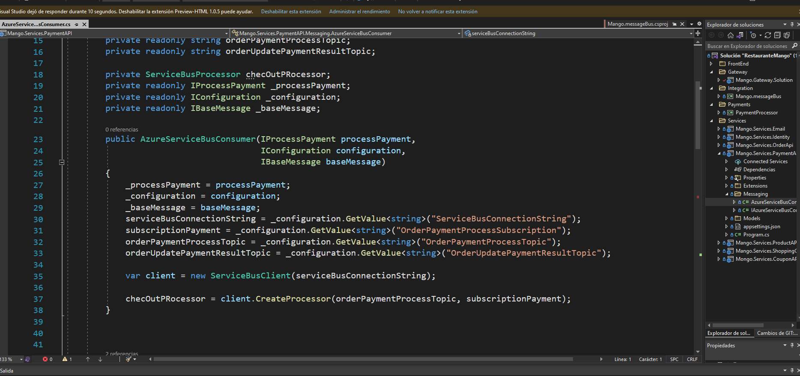
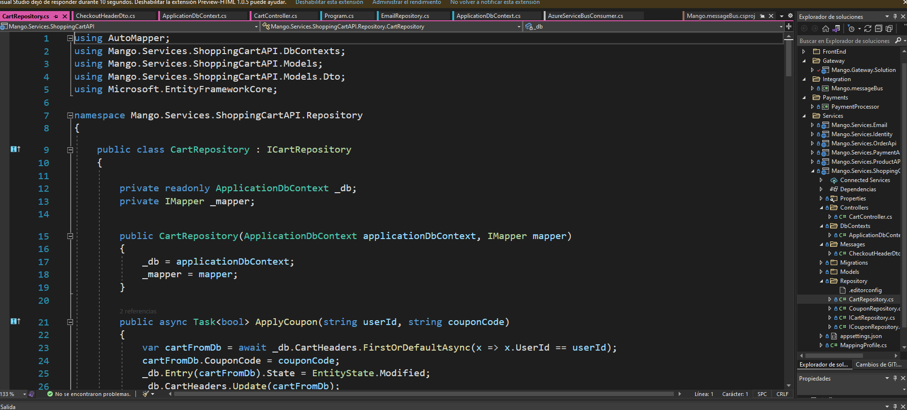
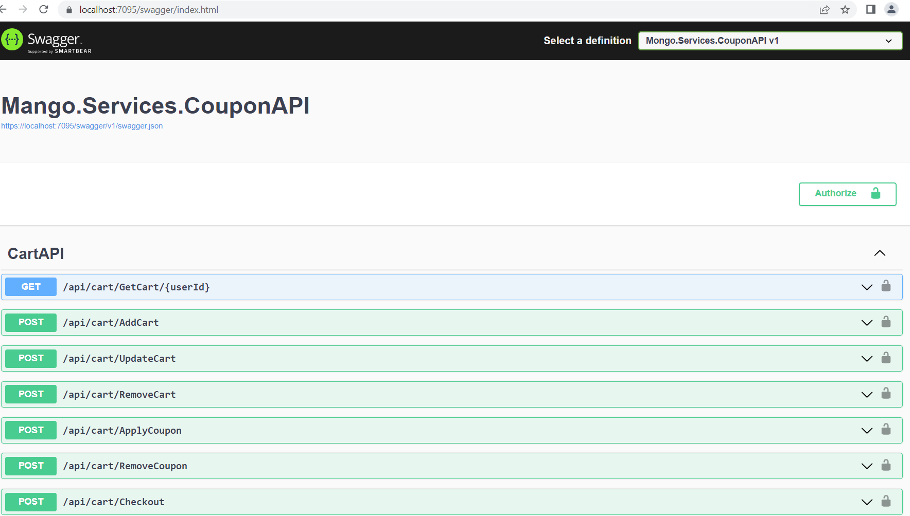
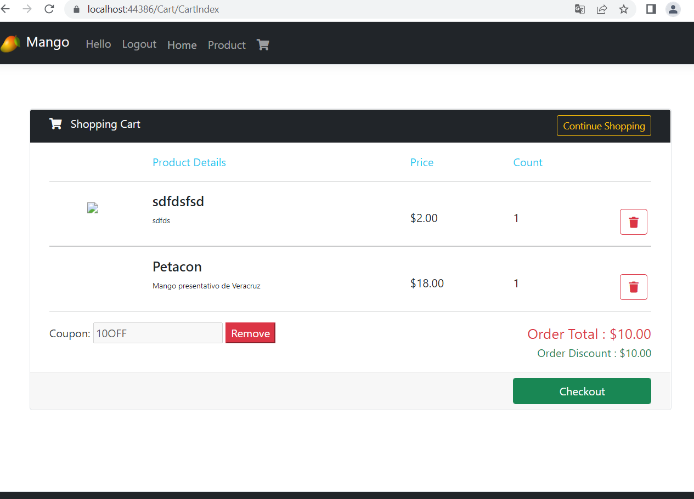
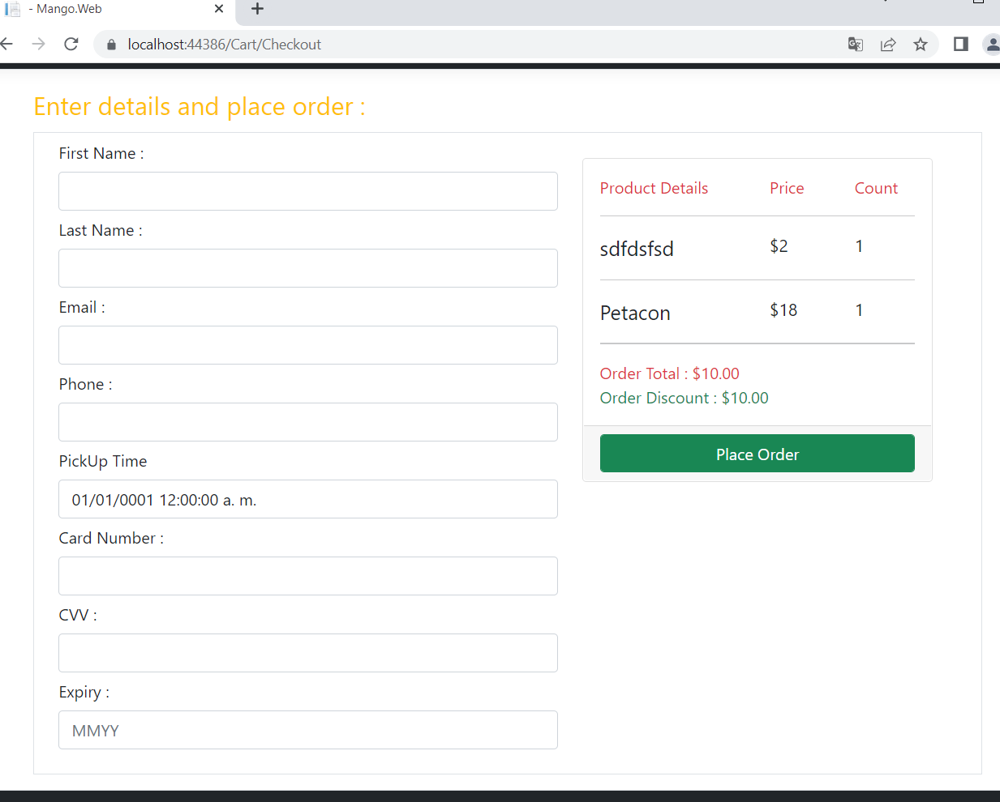

# RestauranteMango
Microservicio con .NET Core MVC 6 e Integración de Identity Server con Azure Service Bus.

### Pre-requisitos 📋

* Visual studio 2022 / Visual Studio Code
* Microsoft .NET Core 5

## Caracteristicas.
* Entity Framework Core
* Net 5
* NET Core API y MVC UI
* Swagger
* Repository Pattern - Generic
* Microsoft Identity with JWT Authentication
* Email con SendGrid
* Fluent Validation
* JwtBearer
* Identity Server OAuth2 Duende
* Autenticación y Authorización
* Azure Service Bus
* Ocelot

# Librerías
- AutoMapper
- Swashbuckle.AspNetCore.SwaggerUI
- Swashbuckle.AspNetCore.Annotations
- Microsoft.AspNetCore.Authentication.JwtBearer
- Microsoft.EntityFrameworkCore.Tools
- Microsoft.EntityFrameworkCore.SqlServer
- Ocelot
- Microsoft.Azure.ServiceBus
- Azure.Messaging.ServiceBus
- Duende.IdentityServer.AspNetIdentity

## Capturas

## Autor ✒️
